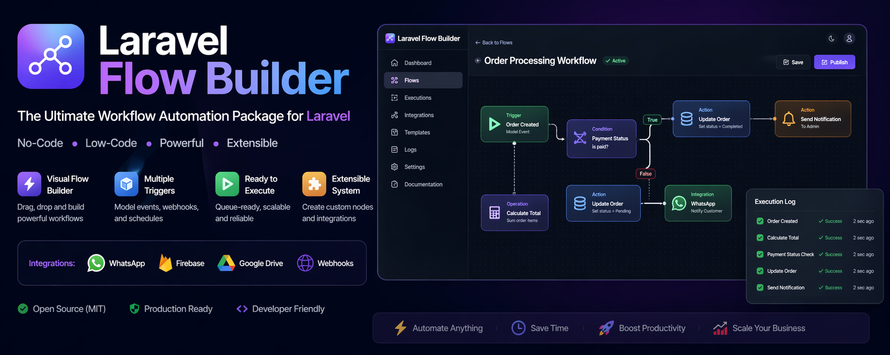

# Laravel Flow Builder

[](https://packagist.org/packages/arabiacode/laravel-flow-builder)
[](https://packagist.org/packages/arabiacode/laravel-flow-builder)
[](https://php.net)
[](https://laravel.com)
[](LICENSE)

A production-ready Laravel package for no-code and low-code workflow automation.

Build business flows using triggers and visual nodes, then execute them through model events, webhooks, or scheduled tasks.

## Why Laravel Flow Builder?

- Replace complex business logic with visual flows
- Reduce development time
- Centralize automation
- Scalable & queue-ready

## Use Cases

- E-commerce automation
- CRM workflows
- Notifications pipelines
- ERP systems

## Contents

- Features
- Requirements
- Download and Installation
- Publish Assets
- Configuration
- Package UI and Routes
- API Endpoints
- Quick Start
- Node Types
- Trigger Types
- Artisan Commands
- Queue and Scheduler Setup
- Extend with Custom Executors
- Manual Execution in Code
- Environment Variables
- License

## Features

- Visual flow builder UI for creating and managing flows
- Trigger-based execution: model events, webhook calls, and schedule
- Built-in node system:
  - trigger
  - condition
  - action
  - operation
  - integration
- Action operations for CRUD, query, notifications, email, and WhatsApp
- Operation nodes for sum, subtract, multiply, divide, text formatting, and loops
- Integration nodes for webhook, WhatsApp, Firebase, and Google Drive placeholder
- Template variable resolution with mustache syntax, for example {{order.total}}
- Per-node execution logs and flow execution history
- Queue-ready architecture for asynchronous execution
- Infinite loop protection via configurable node execution limits
- Extensible executor map for custom node types

## Requirements

- PHP 8.1 or higher
- Laravel 11, 12 or 13

## Download and Installation

Install from Packagist:

```bash
composer require arabiacode/laravel-flow-builder
```

Run migrations:

```bash
php artisan migrate
```

## Publish Assets

Publish configuration file:

```bash
php artisan vendor:publish --tag=flow-builder-config
```

Publish package views (optional customization):

```bash
php artisan vendor:publish --tag=flow-builder-views
```

## Configuration

After publishing, configure the package in config/flow-builder.php.

Key options:

- queue.enabled: Enable or disable queue execution (default: false)
- queue.connection: Queue connection name
- queue.queue: Queue name (default: flows)
- retry.max_attempts: Retry attempts for failed jobs
- retry.delay: Delay between retries
- max_node_executions: Loop protection threshold
- route_prefix: API prefix (default: api/flow-builder)
- route_middleware: API middleware stack
- web_prefix: Web UI prefix (default: flow-builder)
- web_middleware: Web UI middleware stack
- logging.enabled: Enable flow logging
- logging.channel: Log channel override
- executors: Register custom executors
- integrations: Service credentials for WhatsApp, Firebase, and Google Drive

## Package UI and Routes

Web UI base route:

- /flow-builder

Main UI pages:

- Dashboard
- Flows
- Executions
- Integrations
- Package Guide

All UI route settings can be changed through config/flow-builder.php.

## API Endpoints

Default API prefix: /api/flow-builder

- POST /webhook/{flow}
- POST /flows/{flow}/execute

Both endpoints accept JSON payloads as flow input.

## Quick Start

### 1) Create a flow

```php
use Arabiacode\LaravelFlowBuilder\Models\Flow;

$flow = Flow::create([
    'name' => 'Order Processing',
    'description' => 'Process new orders automatically',
    'is_active' => true,
]);
```

### 2) Add a trigger

```php
use Arabiacode\LaravelFlowBuilder\Models\FlowTrigger;

FlowTrigger::create([
    'flow_id' => $flow->id,
    'type' => 'model',
    'model_class' => \App\Models\Order::class,
    'event' => 'created',
]);
```

### 3) Add nodes and connections

Use the builder UI, or create nodes programmatically with FlowNode and FlowConnection.

### 4) Execute manually via API

```bash
curl -X POST http://localhost/api/flow-builder/flows/1/execute \
  -H "Content-Type: application/json" \
  -d '{"order_id":1,"status":"new"}'
```

## Node Types

### trigger

Entry point for flow execution and payload mapping.

### condition

Evaluates logical rules and follows true or false branch connections.

Supported operators include:

- equals
- not_equals
- greater_than
- less_than
- greater_or_equal
- less_or_equal
- contains
- not_contains
- starts_with
- ends_with
- in
- exists
- not_exists

### action

Supported built-in actions:

- create
- update
- delete
- increment
- decrement
- get
- first
- find
- send_notification
- send_email
- send_whatsapp

### operation

Supported operation types:

- sum
- subtract
- multiply
- divide
- format_text
- loop

### integration

Supported integration types:

- webhook
- whatsapp
- firebase
- google_drive (placeholder implementation)

## Trigger Types

- model: Triggered by Eloquent model events
- webhook: Triggered by external HTTP request
- schedule: Triggered by cron expression via command

## Artisan Commands

```bash
php artisan flow-builder:run-scheduled
php artisan flow-builder:clear-cache
```

## Queue and Scheduler Setup

If you use scheduled triggers, register this command in your scheduler:

```php
$schedule->command('flow-builder:run-scheduled')->everyMinute();
```

If queue execution is enabled, make sure your queue worker is running:

```bash
php artisan queue:work --queue=flows
```

## Extend with Custom Executors

Implement the executor contract:

```php
use Arabiacode\LaravelFlowBuilder\Contracts\NodeExecutor;
use Arabiacode\LaravelFlowBuilder\Engine\FlowState;
use Arabiacode\LaravelFlowBuilder\Models\FlowNode;

class SmsExecutor implements NodeExecutor
{
    public function execute(FlowNode $node, FlowState $state): mixed
    {
        return ['ok' => true];
    }
}
```

Register in config/flow-builder.php:

```php
'executors' => [
    'sms' => \App\FlowExecutors\SmsExecutor::class,
],
```

## Manual Execution in Code

```php
use Arabiacode\LaravelFlowBuilder\Facades\FlowBuilder;
use Arabiacode\LaravelFlowBuilder\Models\Flow;

$flow = Flow::findOrFail(1);

$execution = FlowBuilder::execute($flow, [
    'order_id' => 1201,
    'customer_name' => 'Sara',
]);

$status = $execution->status;
```

## Environment Variables

- FLOW_BUILDER_QUEUE_ENABLED
- FLOW_BUILDER_QUEUE_CONNECTION
- FLOW_BUILDER_QUEUE_NAME
- FLOW_BUILDER_LOG_CHANNEL
- FLOW_BUILDER_WHATSAPP_API_URL
- FLOW_BUILDER_WHATSAPP_API_KEY
- FLOW_BUILDER_FIREBASE_SERVER_KEY
- FLOW_BUILDER_GOOGLE_DRIVE_CREDENTIALS

## License

MIT. See LICENSE for details.

Developed by ArabiaCode.

If you like this package, please ⭐ star the repo!
